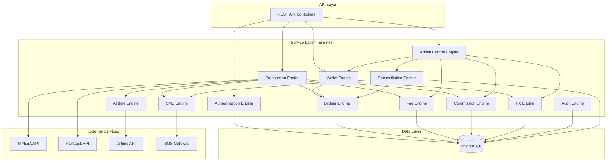
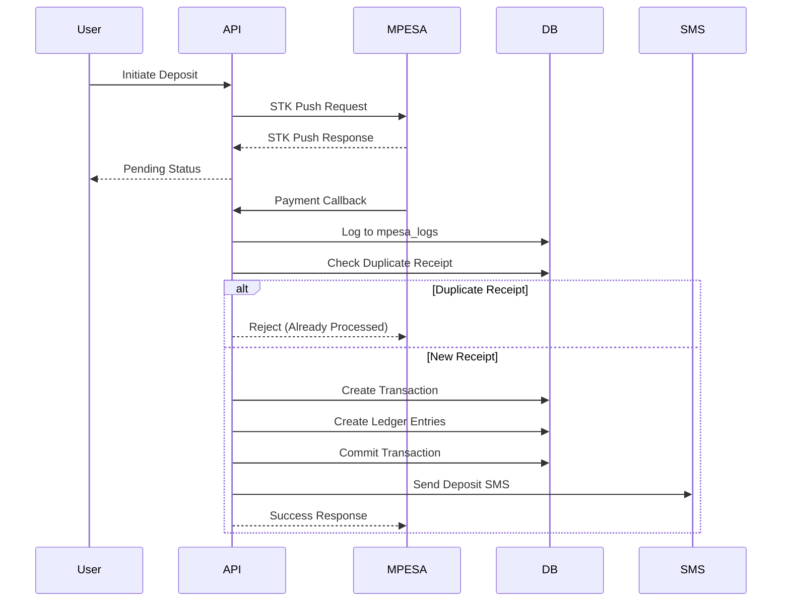
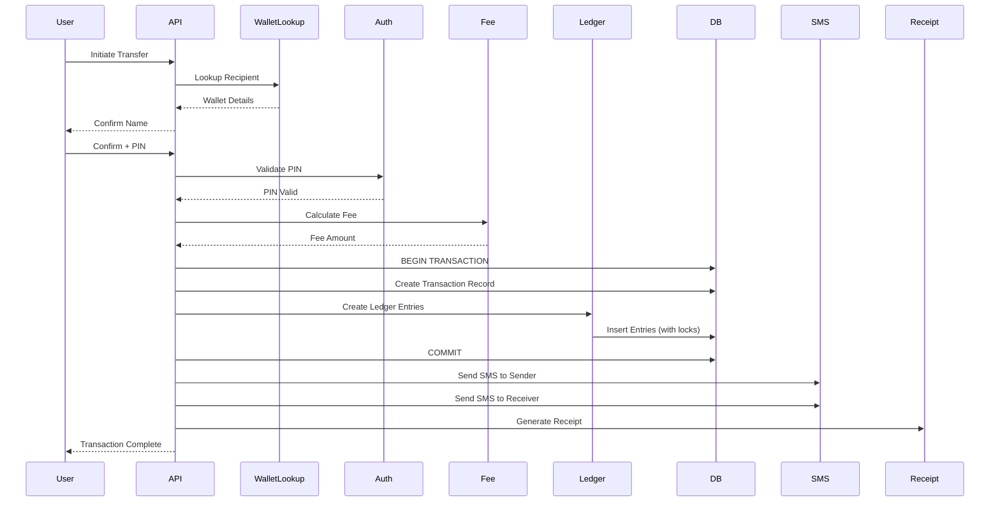
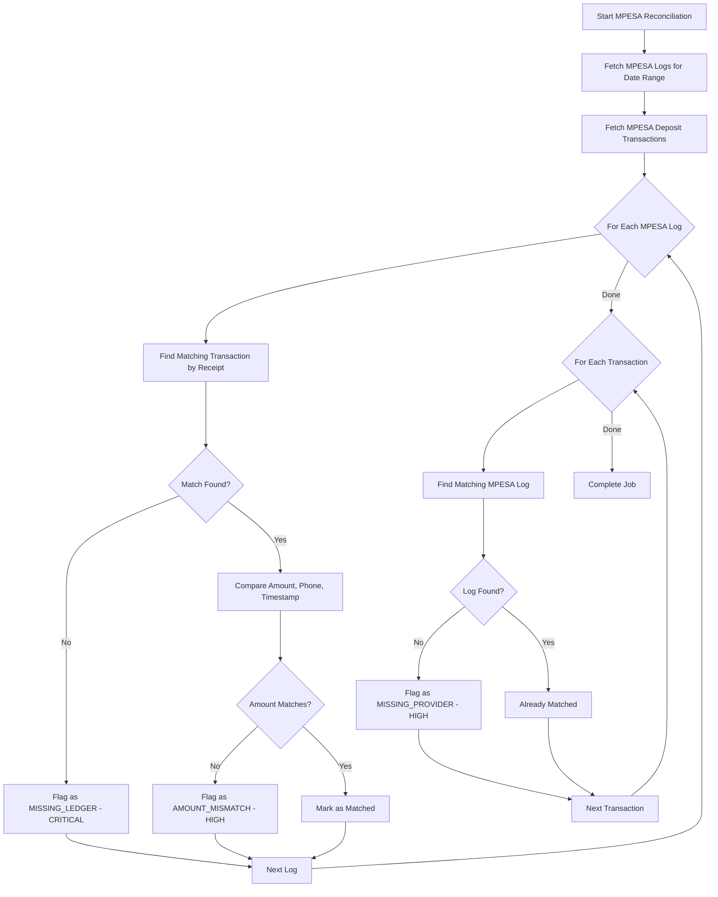
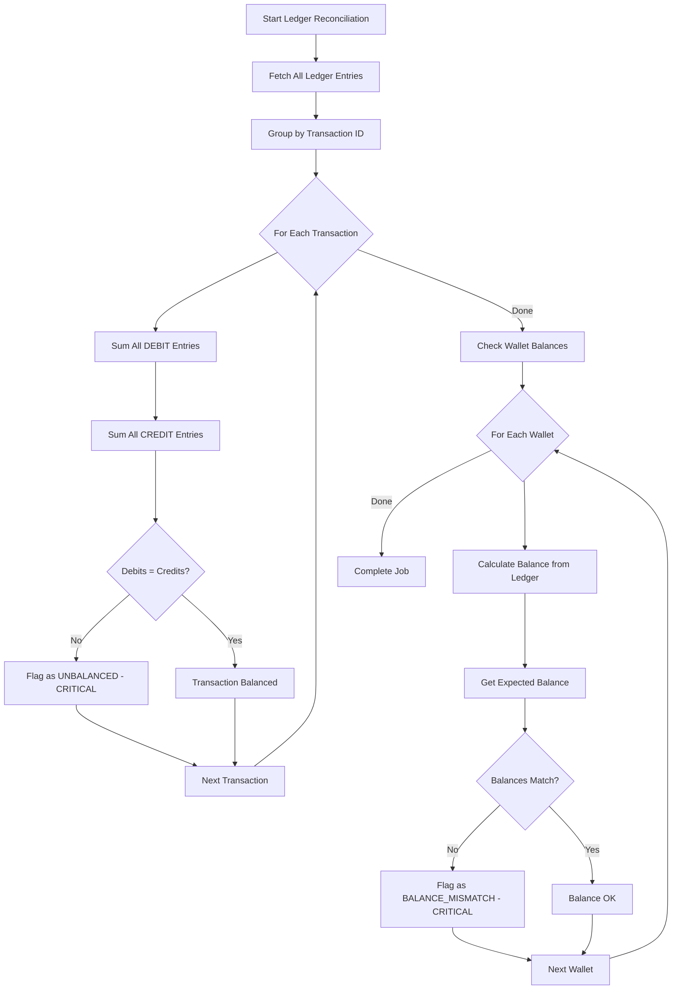

# Design Document: Aban Remit Core Backend

## Overview

The Aban Remit Core Backend is a modular monolith financial platform implementing a double-entry accounting system for multi-currency digital wallets. The system is built on PostgreSQL with Node.js/TypeScript and follows a layered architecture with clear separation between engines.

### Core Design Principles

1. **Double-Entry Accounting**: All financial transactions create paired debit/credit ledger entries
2. **Derived Balances**: Wallet balances are calculated from ledger entries, never stored directly
3. **Immutability**: Ledger entries and audit logs are immutable; reversals create new entries
4. **Idempotency**: All transaction endpoints support idempotency keys to prevent duplicates
5. **Atomicity**: All financial operations execute within database transactions
6. **Security-First**: bcrypt password hashing (12+ rounds), JWT tokens (15-min expiry), OTP (5-min expiry)

### Technology Stack

- **Runtime**: Node.js 18+ with TypeScript 5+
- **Database**: PostgreSQL 15+ with UUID v4 primary keys
- **Authentication**: JWT tokens with bcrypt password hashing
- **External APIs**: MPESA (STK Push, B2C), Paystack, Airtime provider, SMS gateway
- **Testing**: Jest for unit tests, fast-check for property-based tests

## Architecture

### System Architecture Diagram




### Layered Architecture

The system follows a three-tier architecture:

1. **API Layer**: REST controllers handling HTTP requests, authentication middleware, rate limiting
2. **Service Layer**: Business logic engines with clear responsibilities and interfaces
3. **Data Layer**: PostgreSQL database with repositories for data access

### Engine Responsibilities

- **Authentication Engine**: User/agent registration, OTP generation/verification, JWT token management, device tracking
- **Wallet Engine**: Wallet creation, state management, balance calculation from ledger
- **Ledger Engine**: Double-entry bookkeeping, ledger entry creation, balance calculation, reconciliation
- **Transaction Engine**: Orchestrates deposits, withdrawals, P2P transfers, agent transactions
- **Fee Engine**: Fee calculation based on configurable rules (FIXED/PERCENTAGE/TIERED)
- **Commission Engine**: Agent commission calculation and crediting
- **FX Engine**: Currency conversion using admin-managed exchange rates
- **Airtime Engine**: Airtime purchase integration with external provider
- **SMS Engine**: SMS notification delivery with retry logic
- **Admin Control Engine**: Wallet state changes, fee/commission/rate configuration
- **Audit Engine**: Immutable logging of all critical operations
- **Reconciliation Engine**: Automated reconciliation of provider transactions against ledger, discrepancy detection and management

## Components and Interfaces

### Authentication Engine

**Responsibilities**: User authentication, authorization, session management

**Key Interfaces**:

```typescript
interface AuthenticationEngine {
  registerUser(phone: string, password: string): Promise<User>
  registerAgent(businessName: string, phone: string, idDocs: string[]): Promise<Agent>
  generateOTP(userId: string): Promise<OTP>
  verifyOTP(userId: string, code: string): Promise<boolean>
  authenticate(phone: string, password: string): Promise<AuthToken>
  refreshToken(expiredToken: string): Promise<AuthToken>
  logoutUser(token: string): Promise<void>
  logDevice(userId: string, deviceInfo: DeviceInfo): Promise<Device>
}

interface User {
  id: string // UUID v4
  phone: string
  passwordHash: string
  role: 'USER' | 'AGENT' | 'ADMIN'
  walletId: string // WLT7770001 format
  createdAt: Date
}

interface AuthToken {
  token: string // JWT
  expiresAt: Date // 15 minutes from issue
  userId: string
  role: string
  walletId: string
}

interface OTP {
  code: string // 6-digit numeric
  expiresAt: Date // 5 minutes from generation
  userId: string
}
```

**Password Hashing**: Use bcrypt with cost factor 12 (2^12 rounds)

**JWT Payload**:
```typescript
interface JWTPayload {
  userId: string
  role: 'USER' | 'AGENT' | 'ADMIN'
  walletId: string
  iat: number // issued at
  exp: number // expires at (15 minutes)
}
```


### Wallet Engine

**Responsibilities**: Wallet lifecycle management, state transitions, balance queries

**Key Interfaces**:

```typescript
interface WalletEngine {
  createWallet(ownerId: string, type: 'USER' | 'AGENT'): Promise<Wallet>
  getWallet(walletId: string): Promise<Wallet>
  getBalance(walletId: string, currency: Currency): Promise<Balance>
  changeState(walletId: string, newState: WalletState, reason: string, adminId: string): Promise<void>
  canTransact(walletId: string, operation: 'DEPOSIT' | 'WITHDRAW'): Promise<boolean>
}

interface Wallet {
  id: string // WLT7770001 or AGT8880001
  ownerId: string // User or Agent ID
  type: 'USER' | 'AGENT'
  state: WalletState
  createdAt: Date
  updatedAt: Date
}

type WalletState = 'ACTIVE' | 'LOCKED' | 'FROZEN' | 'SUSPENDED'

interface Balance {
  walletId: string
  currency: Currency
  amount: Decimal // Calculated from ledger entries
  lastUpdated: Date
}

type Currency = 'KES' | 'USD' | 'EUR'
```

**Wallet ID Generation**:
- User wallets: `WLT` + 7-digit sequential number (WLT7770001)
- Agent wallets: `AGT` + 7-digit sequential number (AGT8880001)

**State Transition Rules**:
- ACTIVE → LOCKED, FROZEN, SUSPENDED (admin action)
- LOCKED → ACTIVE (admin action)
- FROZEN → ACTIVE, SUSPENDED (admin action)
- SUSPENDED → ACTIVE (admin action)

**Transaction Permissions by State**:
- ACTIVE: All operations allowed
- LOCKED: No operations allowed
- FROZEN: Deposits allowed, withdrawals blocked
- SUSPENDED: Only admin-initiated operations allowed


### Ledger Engine

**Responsibilities**: Double-entry bookkeeping, immutable ledger entries, balance calculation

**Key Interfaces**:

```typescript
interface LedgerEngine {
  createEntry(entry: LedgerEntryInput): Promise<LedgerEntry>
  createPairedEntries(debit: LedgerEntryInput, credit: LedgerEntryInput): Promise<[LedgerEntry, LedgerEntry]>
  calculateBalance(walletId: string, currency: Currency): Promise<Decimal>
  getEntries(walletId: string, filters?: EntryFilters): Promise<LedgerEntry[]>
  reconcile(dateRange?: DateRange): Promise<ReconciliationReport>
}

interface LedgerEntry {
  id: string // UUID v4
  transactionId: string // Links to transaction
  walletId: string
  currency: Currency
  amount: Decimal // Always positive
  entryType: 'DEBIT' | 'CREDIT'
  description: string
  createdAt: Date // Immutable timestamp
}

interface LedgerEntryInput {
  transactionId: string
  walletId: string
  currency: Currency
  amount: Decimal
  entryType: 'DEBIT' | 'CREDIT'
  description: string
}

interface ReconciliationReport {
  totalDebits: Map<Currency, Decimal>
  totalCredits: Map<Currency, Decimal>
  balanced: boolean
  discrepancies: Discrepancy[]
}
```

**Double-Entry Rules**:
1. Every transaction creates exactly two entries: one DEBIT and one CREDIT
2. DEBIT amount must equal CREDIT amount (in same currency)
3. Sum of all DEBIT entries must equal sum of all CREDIT entries (per currency)
4. Entries are immutable once created
5. Reversals create new offsetting entries

**Balance Calculation**:
```
Balance = SUM(CREDIT entries) - SUM(DEBIT entries)
```

**System Accounts** (for suspense and revenue tracking):
- `MPESA_SUSPENSE`: Holds funds in transit from MPESA
- `PAYSTACK_SUSPENSE`: Holds funds in transit from Paystack
- `AIRTIME_SUSPENSE`: Holds funds for airtime purchases
- `FEE_REVENUE`: Accumulates transaction fees
- `COMMISSION_EXPENSE`: Tracks agent commission payments


### Transaction Engine

**Responsibilities**: Orchestrate all transaction types, coordinate with other engines

**Key Interfaces**:

```typescript
interface TransactionEngine {
  deposit(request: DepositRequest): Promise<Transaction>
  withdraw(request: WithdrawRequest): Promise<Transaction>
  transfer(request: TransferRequest): Promise<Transaction>
  agentCashIn(request: AgentCashInRequest): Promise<Transaction>
  agentCashOut(request: AgentCashOutRequest): Promise<Transaction>
  getTransaction(transactionId: string): Promise<Transaction>
  getTransactionHistory(walletId: string, filters?: TransactionFilters): Promise<Transaction[]>
}

interface Transaction {
  id: string // UUID v4
  type: TransactionType
  status: TransactionStatus
  sourceWalletId?: string
  destinationWalletId?: string
  currency: Currency
  amount: Decimal
  fee: Decimal
  commission?: Decimal
  exchangeRate?: Decimal
  idempotencyKey: string
  metadata: Record<string, any>
  createdAt: Date
  completedAt?: Date
}

type TransactionType = 
  | 'DEPOSIT_MPESA'
  | 'DEPOSIT_CARD'
  | 'WITHDRAW_MPESA'
  | 'TRANSFER_P2P'
  | 'AGENT_CASH_IN'
  | 'AGENT_CASH_OUT'
  | 'FX_CONVERSION'
  | 'AIRTIME_PURCHASE'

type TransactionStatus = 'PENDING' | 'COMPLETED' | 'FAILED' | 'REVERSED'

interface DepositRequest {
  walletId: string
  amount: Decimal
  currency: Currency
  method: 'MPESA' | 'CARD'
  phone?: string // For MPESA
  idempotencyKey?: string
}

interface WithdrawRequest {
  walletId: string
  amount: Decimal
  currency: Currency
  phone: string // MPESA phone number
  idempotencyKey?: string
}

interface TransferRequest {
  sourceWalletId: string
  destinationWalletId: string
  amount: Decimal
  currency: Currency
  idempotencyKey?: string
}
```

**Transaction Flow Pattern**:
1. Validate request (wallet state, balance, limits)
2. Check idempotency key
3. Calculate fees and commissions
4. Create transaction record (status: PENDING)
5. Execute within database transaction:
   - Create ledger entries
   - Call external APIs if needed
   - Update transaction status
6. Send SMS notification
7. Return transaction result


### Fee Engine

**Responsibilities**: Calculate transaction fees based on configurable rules

**Key Interfaces**:

```typescript
interface FeeEngine {
  calculateFee(transactionType: TransactionType, amount: Decimal): Promise<Decimal>
  createFeeConfig(config: FeeConfigInput): Promise<FeeConfig>
  updateFeeConfig(configId: string, updates: Partial<FeeConfigInput>): Promise<FeeConfig>
  getActiveFeeConfig(transactionType: TransactionType): Promise<FeeConfig>
}

interface FeeConfig {
  id: string // UUID v4
  transactionType: TransactionType
  feeType: 'FIXED' | 'PERCENTAGE' | 'TIERED'
  fixedAmount?: Decimal
  percentage?: Decimal // 0-100
  tiers?: FeeTier[]
  active: boolean
  createdAt: Date
  createdBy: string // Admin ID
}

interface FeeTier {
  minAmount: Decimal
  maxAmount: Decimal
  feeAmount: Decimal
}

interface FeeConfigInput {
  transactionType: TransactionType
  feeType: 'FIXED' | 'PERCENTAGE' | 'TIERED'
  fixedAmount?: Decimal
  percentage?: Decimal
  tiers?: FeeTier[]
}
```

**Fee Calculation Logic**:

- **FIXED**: Return the configured fixed amount regardless of transaction amount
- **PERCENTAGE**: Calculate `amount * (percentage / 100)`
- **TIERED**: Find the tier where `minAmount <= amount <= maxAmount`, return that tier's fee

**Fee Application**:
When a fee is calculated, create ledger entries:
- DEBIT user wallet (fee amount)
- CREDIT FEE_REVENUE account (fee amount)


### Commission Engine

**Responsibilities**: Calculate and credit agent commissions

**Key Interfaces**:

```typescript
interface CommissionEngine {
  calculateCommission(transactionType: TransactionType, amount: Decimal): Promise<Decimal>
  creditCommission(agentWalletId: string, amount: Decimal, transactionId: string): Promise<void>
  createCommissionConfig(config: CommissionConfigInput): Promise<CommissionConfig>
  updateCommissionConfig(configId: string, updates: Partial<CommissionConfigInput>): Promise<CommissionConfig>
  getActiveCommissionConfig(transactionType: TransactionType): Promise<CommissionConfig>
  getAgentCommissionReport(agentWalletId: string, dateRange?: DateRange): Promise<CommissionReport>
}

interface CommissionConfig {
  id: string // UUID v4
  transactionType: TransactionType
  commissionType: 'FIXED' | 'PERCENTAGE' | 'TIERED'
  fixedAmount?: Decimal
  percentage?: Decimal // 0-100
  tiers?: CommissionTier[]
  active: boolean
  createdAt: Date
  createdBy: string // Admin ID
}

interface CommissionTier {
  minAmount: Decimal
  maxAmount: Decimal
  commissionAmount: Decimal
}

interface CommissionReport {
  agentWalletId: string
  totalCommission: Decimal
  transactionCount: number
  dateRange: DateRange
}
```

**Commission Calculation Logic**: Same as fee calculation (FIXED/PERCENTAGE/TIERED)

**Commission Application**:
When a commission is calculated, create ledger entries:
- DEBIT COMMISSION_EXPENSE account (commission amount)
- CREDIT agent wallet (commission amount)


### FX Engine

**Responsibilities**: Currency conversion using admin-managed exchange rates

**Key Interfaces**:

```typescript
interface FXEngine {
  convertCurrency(amount: Decimal, fromCurrency: Currency, toCurrency: Currency): Promise<ConversionResult>
  getExchangeRate(fromCurrency: Currency, toCurrency: Currency): Promise<ExchangeRate>
  updateExchangeRate(fromCurrency: Currency, toCurrency: Currency, rate: Decimal, adminId: string): Promise<ExchangeRate>
  getExchangeRateHistory(currencyPair: string): Promise<ExchangeRate[]>
}

interface ExchangeRate {
  id: string // UUID v4
  fromCurrency: Currency
  toCurrency: Currency
  rate: Decimal // How many toCurrency units per 1 fromCurrency unit
  updatedBy: string // Admin ID
  createdAt: Date
}

interface ConversionResult {
  fromAmount: Decimal
  fromCurrency: Currency
  toAmount: Decimal
  toCurrency: Currency
  exchangeRate: Decimal
  margin?: Decimal // Optional FX margin/spread
}
```

**Supported Currency Pairs**:
- KES/USD, USD/KES
- KES/EUR, EUR/KES
- USD/EUR, EUR/USD

**Inverse Rate Calculation**:
If rate for USD/KES is 150, then rate for KES/USD is 1/150 = 0.00667

**FX Transaction Flow**:
1. Get current exchange rate for currency pair
2. Calculate destination amount: `sourceAmount * exchangeRate`
3. Apply FX margin if configured (e.g., 1% markup)
4. Create ledger entries:
   - DEBIT source currency wallet
   - CREDIT destination currency wallet
5. Record exchange rate used in transaction


### Airtime Engine

**Responsibilities**: Purchase airtime via external provider API

**Key Interfaces**:

```typescript
interface AirtimeEngine {
  purchaseAirtime(request: AirtimePurchaseRequest): Promise<AirtimePurchaseResult>
  getAirtimeProviders(): Promise<AirtimeProvider[]>
}

interface AirtimePurchaseRequest {
  walletId: string
  phone: string
  amount: Decimal // In KES
  provider: string // e.g., 'Safaricom', 'Airtel'
  idempotencyKey?: string
}

interface AirtimePurchaseResult {
  transactionId: string
  status: 'COMPLETED' | 'FAILED'
  phone: string
  amount: Decimal
  providerReference?: string
  errorMessage?: string
}

interface AirtimeProvider {
  code: string
  name: string
  minAmount: Decimal
  maxAmount: Decimal
}
```

**Airtime Purchase Flow**:
1. Validate wallet has sufficient KES balance
2. Calculate transaction fee
3. Create transaction record (status: PENDING)
4. Create ledger entries:
   - DEBIT user wallet (amount + fee)
   - CREDIT AIRTIME_SUSPENSE account (amount)
   - CREDIT FEE_REVENUE account (fee)
5. Call external Airtime API
6. If API succeeds: Update transaction status to COMPLETED
7. If API fails: Create reversing ledger entries, update status to FAILED
8. Send SMS notification


### SMS Engine

**Responsibilities**: Send SMS notifications with retry logic

**Key Interfaces**:

```typescript
interface SMSEngine {
  sendOTP(phone: string, code: string): Promise<SMSResult>
  sendTransactionNotification(phone: string, transaction: Transaction, newBalance: Decimal): Promise<SMSResult>
  sendCustomMessage(phone: string, message: string): Promise<SMSResult>
}

interface SMSResult {
  id: string // SMS provider's message ID
  phone: string
  status: 'SENT' | 'FAILED'
  sentAt?: Date
  errorMessage?: string
}
```

**SMS Retry Logic**:
- Retry up to 3 times on failure
- Use exponential backoff: 1s, 2s, 4s
- Log all attempts in audit trail
- If all retries fail, log final failure

**SMS Templates**:

- **OTP**: `Your ABAN verification code is {code}. Valid for 5 minutes.`
- **Deposit**: `Deposit of {amount} {currency} successful. New balance: {balance} {currency}. Ref: {txnId}`
- **Withdrawal**: `Withdrawal of {amount} {currency} successful. New balance: {balance} {currency}. Ref: {txnId}`
- **Transfer Sent**: `You sent {amount} {currency} to {recipient}. New balance: {balance} {currency}. Ref: {txnId}`
- **Transfer Received**: `You received {amount} {currency} from {sender}. New balance: {balance} {currency}. Ref: {txnId}`


### Admin Control Engine

**Responsibilities**: Administrative operations for system configuration and control

**Key Interfaces**:

```typescript
interface AdminControlEngine {
  changeWalletState(walletId: string, newState: WalletState, reason: string, adminId: string): Promise<void>
  createFeeConfig(config: FeeConfigInput, adminId: string): Promise<FeeConfig>
  updateFeeConfig(configId: string, updates: Partial<FeeConfigInput>, adminId: string): Promise<FeeConfig>
  createCommissionConfig(config: CommissionConfigInput, adminId: string): Promise<CommissionConfig>
  updateCommissionConfig(configId: string, updates: Partial<CommissionConfigInput>, adminId: string): Promise<CommissionConfig>
  updateExchangeRate(fromCurrency: Currency, toCurrency: Currency, rate: Decimal, adminId: string): Promise<ExchangeRate>
  approveAgent(agentId: string, adminId: string): Promise<void>
  getSystemMetrics(): Promise<SystemMetrics>
}

interface SystemMetrics {
  totalUsers: number
  totalAgents: number
  totalWallets: number
  totalTransactions: number
  totalVolume: Map<Currency, Decimal>
  activeWallets: number
  lockedWallets: number
  frozenWallets: number
  suspendedWallets: number
}
```

**Admin Operations Audit**:
All admin operations must be logged in the audit trail with:
- Admin user ID
- Operation type
- Entity affected (wallet ID, config ID, etc.)
- Old value and new value
- Reason (for wallet state changes)
- Timestamp


### Audit Engine

**Responsibilities**: Immutable logging of all critical system operations

**Key Interfaces**:

```typescript
interface AuditEngine {
  logAuthAttempt(userId: string, success: boolean, ipAddress: string, userAgent: string): Promise<void>
  logWalletStateChange(walletId: string, oldState: WalletState, newState: WalletState, reason: string, adminId: string): Promise<void>
  logConfigChange(entityType: string, entityId: string, changes: Record<string, any>, adminId: string): Promise<void>
  logTransactionFailure(transactionId: string, errorReason: string): Promise<void>
  queryAuditTrail(filters: AuditFilters): Promise<AuditEntry[]>
}

interface AuditEntry {
  id: string // UUID v4
  entityType: string // 'AUTH', 'WALLET', 'CONFIG', 'TRANSACTION', etc.
  entityId: string
  action: string
  actorId?: string // User/Admin who performed the action
  metadata: Record<string, any>
  ipAddress?: string
  createdAt: Date // Immutable
}

interface AuditFilters {
  entityType?: string
  entityId?: string
  actorId?: string
  dateRange?: DateRange
  limit?: number
  offset?: number
}
```

**Audit Trail Requirements**:
- All entries are immutable (no updates or deletes)
- Each entry has a unique UUID v4 ID
- Timestamps are automatically set on creation
- Sensitive data (passwords, tokens) must never be logged
- Audit queries support pagination


## Data Models

### Database Schema

```sql
-- Users and Authentication
CREATE TABLE users (
  id UUID PRIMARY KEY DEFAULT gen_random_uuid(),
  phone VARCHAR(20) UNIQUE NOT NULL,
  password_hash VARCHAR(255) NOT NULL,
  role VARCHAR(20) NOT NULL CHECK (role IN ('USER', 'AGENT', 'ADMIN')),
  wallet_id VARCHAR(20) UNIQUE NOT NULL,
  created_at TIMESTAMP DEFAULT NOW(),
  updated_at TIMESTAMP DEFAULT NOW()
);

CREATE TABLE otps (
  id UUID PRIMARY KEY DEFAULT gen_random_uuid(),
  user_id UUID NOT NULL REFERENCES users(id),
  code VARCHAR(6) NOT NULL,
  expires_at TIMESTAMP NOT NULL,
  verified BOOLEAN DEFAULT FALSE,
  created_at TIMESTAMP DEFAULT NOW()
);

CREATE TABLE devices (
  id UUID PRIMARY KEY DEFAULT gen_random_uuid(),
  user_id UUID NOT NULL REFERENCES users(id),
  device_fingerprint VARCHAR(255) NOT NULL,
  ip_address VARCHAR(45),
  user_agent TEXT,
  first_seen_at TIMESTAMP DEFAULT NOW(),
  last_active_at TIMESTAMP DEFAULT NOW()
);

CREATE TABLE token_blacklist (
  id UUID PRIMARY KEY DEFAULT gen_random_uuid(),
  token_hash VARCHAR(255) UNIQUE NOT NULL,
  expires_at TIMESTAMP NOT NULL,
  created_at TIMESTAMP DEFAULT NOW()
);

-- Wallets
CREATE TABLE wallets (
  id VARCHAR(20) PRIMARY KEY, -- WLT7770001 or AGT8880001
  owner_id UUID NOT NULL REFERENCES users(id),
  type VARCHAR(10) NOT NULL CHECK (type IN ('USER', 'AGENT')),
  state VARCHAR(20) NOT NULL CHECK (state IN ('ACTIVE', 'LOCKED', 'FROZEN', 'SUSPENDED')),
  created_at TIMESTAMP DEFAULT NOW(),
  updated_at TIMESTAMP DEFAULT NOW()
);

CREATE TABLE wallet_state_history (
  id UUID PRIMARY KEY DEFAULT gen_random_uuid(),
  wallet_id VARCHAR(20) NOT NULL REFERENCES wallets(id),
  old_state VARCHAR(20) NOT NULL,
  new_state VARCHAR(20) NOT NULL,
  reason TEXT,
  changed_by UUID REFERENCES users(id),
  created_at TIMESTAMP DEFAULT NOW()
);

-- Ledger (Double-Entry)
CREATE TABLE ledger_entries (
  id UUID PRIMARY KEY DEFAULT gen_random_uuid(),
  transaction_id UUID NOT NULL,
  wallet_id VARCHAR(20) NOT NULL REFERENCES wallets(id),
  currency VARCHAR(3) NOT NULL CHECK (currency IN ('KES', 'USD', 'EUR')),
  amount DECIMAL(19, 2) NOT NULL CHECK (amount > 0),
  entry_type VARCHAR(10) NOT NULL CHECK (entry_type IN ('DEBIT', 'CREDIT')),
  description TEXT,
  created_at TIMESTAMP DEFAULT NOW()
);

CREATE INDEX idx_ledger_wallet_currency ON ledger_entries(wallet_id, currency);
CREATE INDEX idx_ledger_transaction ON ledger_entries(transaction_id);

-- Transactions
CREATE TABLE transactions (
  id UUID PRIMARY KEY DEFAULT gen_random_uuid(),
  type VARCHAR(30) NOT NULL,
  status VARCHAR(20) NOT NULL CHECK (status IN ('PENDING', 'COMPLETED', 'FAILED', 'REVERSED')),
  source_wallet_id VARCHAR(20) REFERENCES wallets(id),
  destination_wallet_id VARCHAR(20) REFERENCES wallets(id),
  currency VARCHAR(3) NOT NULL,
  amount DECIMAL(19, 2) NOT NULL,
  fee DECIMAL(19, 2) DEFAULT 0,
  commission DECIMAL(19, 2),
  exchange_rate DECIMAL(19, 8),
  idempotency_key VARCHAR(255) UNIQUE NOT NULL,
  metadata JSONB,
  created_at TIMESTAMP DEFAULT NOW(),
  completed_at TIMESTAMP
);

CREATE INDEX idx_transactions_wallet ON transactions(source_wallet_id, destination_wallet_id);
CREATE INDEX idx_transactions_idempotency ON transactions(idempotency_key);

-- Fee Configurations
CREATE TABLE fee_configs (
  id UUID PRIMARY KEY DEFAULT gen_random_uuid(),
  transaction_type VARCHAR(30) NOT NULL,
  fee_type VARCHAR(20) NOT NULL CHECK (fee_type IN ('FIXED', 'PERCENTAGE', 'TIERED')),
  fixed_amount DECIMAL(19, 2),
  percentage DECIMAL(5, 2),
  tiers JSONB, -- Array of {minAmount, maxAmount, feeAmount}
  active BOOLEAN DEFAULT TRUE,
  created_by UUID NOT NULL REFERENCES users(id),
  created_at TIMESTAMP DEFAULT NOW()
);

-- Commission Configurations
CREATE TABLE commission_configs (
  id UUID PRIMARY KEY DEFAULT gen_random_uuid(),
  transaction_type VARCHAR(30) NOT NULL,
  commission_type VARCHAR(20) NOT NULL CHECK (commission_type IN ('FIXED', 'PERCENTAGE', 'TIERED')),
  fixed_amount DECIMAL(19, 2),
  percentage DECIMAL(5, 2),
  tiers JSONB, -- Array of {minAmount, maxAmount, commissionAmount}
  active BOOLEAN DEFAULT TRUE,
  created_by UUID NOT NULL REFERENCES users(id),
  created_at TIMESTAMP DEFAULT NOW()
);

-- Exchange Rates
CREATE TABLE exchange_rates (
  id UUID PRIMARY KEY DEFAULT gen_random_uuid(),
  from_currency VARCHAR(3) NOT NULL,
  to_currency VARCHAR(3) NOT NULL,
  rate DECIMAL(19, 8) NOT NULL CHECK (rate > 0),
  updated_by UUID NOT NULL REFERENCES users(id),
  created_at TIMESTAMP DEFAULT NOW(),
  UNIQUE(from_currency, to_currency)
);

CREATE TABLE exchange_rate_history (
  id UUID PRIMARY KEY DEFAULT gen_random_uuid(),
  from_currency VARCHAR(3) NOT NULL,
  to_currency VARCHAR(3) NOT NULL,
  rate DECIMAL(19, 8) NOT NULL,
  updated_by UUID NOT NULL REFERENCES users(id),
  created_at TIMESTAMP DEFAULT NOW()
);

-- Audit Trail
CREATE TABLE audit_entries (
  id UUID PRIMARY KEY DEFAULT gen_random_uuid(),
  entity_type VARCHAR(50) NOT NULL,
  entity_id VARCHAR(255) NOT NULL,
  action VARCHAR(100) NOT NULL,
  actor_id UUID REFERENCES users(id),
  metadata JSONB,
  ip_address VARCHAR(45),
  created_at TIMESTAMP DEFAULT NOW()
);

CREATE INDEX idx_audit_entity ON audit_entries(entity_type, entity_id);
CREATE INDEX idx_audit_actor ON audit_entries(actor_id);
CREATE INDEX idx_audit_created ON audit_entries(created_at);

-- Reconciliation Jobs
CREATE TABLE reconciliation_jobs (
  id UUID PRIMARY KEY DEFAULT gen_random_uuid(),
  job_type VARCHAR(50) NOT NULL CHECK (job_type IN ('MPESA', 'PAYSTACK', 'LEDGER')),
  status VARCHAR(20) NOT NULL CHECK (status IN ('PENDING', 'RUNNING', 'COMPLETED', 'FAILED')),
  start_date DATE NOT NULL,
  end_date DATE NOT NULL,
  total_transactions INT DEFAULT 0,
  matched_transactions INT DEFAULT 0,
  discrepancies_found INT DEFAULT 0,
  started_at TIMESTAMP,
  completed_at TIMESTAMP,
  created_by UUID REFERENCES users(id),
  error_message TEXT,
  created_at TIMESTAMP DEFAULT NOW()
);

CREATE INDEX idx_reconciliation_jobs_type ON reconciliation_jobs(job_type);
CREATE INDEX idx_reconciliation_jobs_status ON reconciliation_jobs(status);
CREATE INDEX idx_reconciliation_jobs_dates ON reconciliation_jobs(start_date, end_date);

-- Reconciliation Discrepancies
CREATE TABLE reconciliation_discrepancies (
  id UUID PRIMARY KEY DEFAULT gen_random_uuid(),
  job_id UUID NOT NULL REFERENCES reconciliation_jobs(id),
  discrepancy_type VARCHAR(50) NOT NULL CHECK (discrepancy_type IN ('MISSING_LEDGER', 'MISSING_PROVIDER', 'AMOUNT_MISMATCH', 'DUPLICATE', 'UNBALANCED', 'BALANCE_MISMATCH')),
  severity VARCHAR(20) NOT NULL CHECK (severity IN ('CRITICAL', 'HIGH', 'MEDIUM', 'LOW')),
  provider VARCHAR(20) CHECK (provider IN ('MPESA', 'PAYSTACK', 'INTERNAL')),
  provider_reference VARCHAR(100),
  transaction_id UUID,
  expected_amount DECIMAL(19, 2),
  actual_amount DECIMAL(19, 2),
  details JSONB,
  status VARCHAR(20) NOT NULL DEFAULT 'PENDING' CHECK (status IN ('PENDING', 'INVESTIGATING', 'RESOLVED', 'IGNORED')),
  resolution_notes TEXT,
  resolved_by UUID REFERENCES users(id),
  resolved_at TIMESTAMP,
  created_at TIMESTAMP DEFAULT NOW()
);

CREATE INDEX idx_discrepancies_job ON reconciliation_discrepancies(job_id);
CREATE INDEX idx_discrepancies_status ON reconciliation_discrepancies(status);
CREATE INDEX idx_discrepancies_severity ON reconciliation_discrepancies(severity);
CREATE INDEX idx_discrepancies_provider ON reconciliation_discrepancies(provider);
CREATE INDEX idx_discrepancies_created ON reconciliation_discrepancies(created_at);
```

### System Accounts

The following special wallet IDs are used for system accounting:

- `MPESA_SUSPENSE`: Holds funds in transit from MPESA deposits/withdrawals
- `PAYSTACK_SUSPENSE`: Holds funds in transit from Paystack card payments
- `AIRTIME_SUSPENSE`: Holds funds for airtime purchases
- `FEE_REVENUE`: Accumulates all transaction fees collected
- `COMMISSION_EXPENSE`: Tracks all agent commissions paid

These accounts must be created during system initialization and should never be deleted.

### Additional Data Models for New Features

```sql
-- MPESA Transaction Logs
CREATE TABLE services.mpesa_logs (
  id UUID PRIMARY KEY DEFAULT gen_random_uuid(),
  mpesa_receipt VARCHAR(50) UNIQUE NOT NULL,
  phone VARCHAR(20) NOT NULL,
  amount DECIMAL(19, 2) NOT NULL,
  raw_payload JSONB NOT NULL,
  created_at TIMESTAMP DEFAULT NOW()
);

CREATE INDEX idx_mpesa_logs_receipt ON services.mpesa_logs(mpesa_receipt);
CREATE INDEX idx_mpesa_logs_phone ON services.mpesa_logs(phone);

-- SMS Logs
CREATE TABLE services.sms_logs (
  id UUID PRIMARY KEY DEFAULT gen_random_uuid(),
  recipient VARCHAR(20) NOT NULL,
  message TEXT NOT NULL,
  cost DECIMAL(10, 4),
  status VARCHAR(20) NOT NULL CHECK (status IN ('SENT', 'FAILED', 'PENDING')),
  provider_message_id VARCHAR(255),
  error_message TEXT,
  created_at TIMESTAMP DEFAULT NOW()
);

CREATE INDEX idx_sms_logs_recipient ON services.sms_logs(recipient);
CREATE INDEX idx_sms_logs_created ON services.sms_logs(created_at);

-- Add verification_hash to transactions table
ALTER TABLE transactions ADD COLUMN verification_hash VARCHAR(64);

-- Add wallet_number index for fast lookups
CREATE INDEX idx_wallets_number ON wallets(id);
```

## Wallet Lookup Engine

**Responsibilities**: Secure wallet information lookup for transaction confirmation

**Key Interfaces**:

```typescript
interface WalletLookupEngine {
  lookupWallet(walletNumber: string): Promise<WalletLookupResult>
}

interface WalletLookupResult {
  walletNumber: string
  fullName: string
  phoneMasked: string // Format: ****1234
  status: WalletState
  kycStatus: 'VERIFIED' | 'PENDING' | 'UNVERIFIED'
}
```

**Security Rules**:
- Never expose full phone number (mask all but last 4 digits)
- Never expose email address
- Never expose internal user ID
- Reject lookups for LOCKED or FROZEN wallets
- Use indexed query on wallet_number for performance

**Phone Masking Logic**:
```typescript
function maskPhone(phone: string): string {
  // Input: +254712345678
  // Output: ****5678
  return '****' + phone.slice(-4)
}
```

## MPESA Integration Enhancements

**MPESA Deposit Flow**:



**MPESA Log Storage**:
```typescript
interface MPESALog {
  id: string
  mpesaReceipt: string // Unique MPESA transaction ID
  phone: string // Sender phone number
  amount: Decimal
  rawPayload: object // Complete callback payload
  createdAt: Date
}
```

**Idempotency Check**:
Before processing any MPESA deposit, query `mpesa_logs` table:
```sql
SELECT id FROM services.mpesa_logs WHERE mpesa_receipt = $1
```
If found, return existing transaction. If not found, proceed with deposit.

## SMS Notification Enhancements

**SMS Templates**:

```typescript
interface SMSTemplates {
  deposit: (amount: Decimal, senderPhone: string, mpesaRef: string, newBalance: Decimal) => string
  withdrawal: (amount: Decimal, fee: Decimal, reference: string, newBalance: Decimal) => string
  transferSent: (amount: Decimal, recipient: string, fee: Decimal, newBalance: Decimal) => string
  transferReceived: (amount: Decimal, sender: string, newBalance: Decimal) => string
}

// Implementation
const templates: SMSTemplates = {
  deposit: (amount, senderPhone, mpesaRef, newBalance) => 
    `ABAN REMIT: Deposit of KES ${amount} received from ${senderPhone}. MPESA Ref: ${mpesaRef} New Balance: KES ${newBalance}.`,
  
  withdrawal: (amount, fee, reference, newBalance) =>
    `ABAN REMIT: You have withdrawn KES ${amount}. Fee: KES ${fee} Reference: ${reference} Available Balance: KES ${newBalance}.`,
  
  transferSent: (amount, recipient, fee, newBalance) =>
    `ABAN REMIT: You sent KES ${amount} to ${recipient}. Fee: KES ${fee} New Balance: KES ${newBalance}.`,
  
  transferReceived: (amount, sender, newBalance) =>
    `ABAN REMIT: You received KES ${amount} from ${sender}. New Balance: KES ${newBalance}.`
}
```

**SMS Logging**:
Every SMS must be logged with:
```typescript
interface SMSLog {
  id: string
  recipient: string
  message: string
  cost: Decimal // Cost in local currency
  status: 'SENT' | 'FAILED' | 'PENDING'
  providerMessageId?: string
  errorMessage?: string
  createdAt: Date
}
```

**SMS Cost Reporting**:
```typescript
interface SMSCostReport {
  dateRange: DateRange
  totalMessages: number
  totalCost: Decimal
  successRate: number // Percentage of successful deliveries
  costByType: Map<string, Decimal> // OTP, Transaction, etc.
}
```

## Receipt Generation Engine

**Responsibilities**: Generate PDF receipts with verification for all transactions

**Key Interfaces**:

```typescript
interface ReceiptEngine {
  generateReceipt(transactionReference: string): Promise<ReceiptPDF>
  verifyReceipt(reference: string, hash: string): Promise<boolean>
}

interface ReceiptPDF {
  pdfBuffer: Buffer
  filename: string
  verificationHash: string
}

interface ReceiptData {
  logo: string // Base64 or URL
  reference: string
  dateTime: Date
  senderName: string
  senderWallet: string
  receiverName: string
  receiverWallet: string
  amount: Decimal
  fee: Decimal
  netAmount: Decimal
  currency: Currency
  status: TransactionStatus
  providerReference?: string
  exchangeRate?: Decimal
  commission?: Decimal
  verificationHash: string
}
```

**Verification Hash Calculation**:
```typescript
function calculateVerificationHash(
  reference: string,
  amount: Decimal,
  createdAt: Date
): string {
  const data = `${reference}${amount.toString()}${createdAt.toISOString()}`
  return crypto.createHash('sha256').update(data).digest('hex')
}
```

**Receipt Layout**:
- A4 size (210mm x 297mm)
- Header: Company logo and "TRANSACTION RECEIPT"
- Body: Two-column layout with transaction details
- Footer: QR code (containing reference) and verification hash
- Print-optimized: Black and white, clear fonts, adequate margins

**QR Code Content**:
```json
{
  "reference": "TXN123456",
  "amount": "1000.00",
  "currency": "KES",
  "date": "2024-01-15T10:30:00Z",
  "hash": "abc123..."
}
```

## Fraud Protection Enhancements

**Transaction Locking Strategy**:
```sql
-- Lock wallet records before balance updates
BEGIN;
SELECT * FROM wallets 
WHERE id IN ($senderWallet, $receiverWallet)
FOR UPDATE;

-- Proceed with ledger entries
INSERT INTO ledger_entries ...

COMMIT;
```

**Self-Transfer Prevention**:
```typescript
function validateTransfer(senderWallet: string, receiverWallet: string): void {
  if (senderWallet === receiverWallet) {
    throw new FraudError('Cannot transfer to the same wallet')
  }
}
```

**Wallet Status Validation**:
```typescript
function validateWalletStatus(wallet: Wallet, operation: 'SEND' | 'RECEIVE'): void {
  if (wallet.state !== 'ACTIVE') {
    throw new ValidationError(`Wallet ${wallet.id} is ${wallet.state}, cannot ${operation}`)
  }
}
```

**MPESA Receipt Idempotency**:
```typescript
async function checkMPESADuplicate(mpesaReceipt: string): Promise<boolean> {
  const existing = await db.query(
    'SELECT id FROM services.mpesa_logs WHERE mpesa_receipt = $1',
    [mpesaReceipt]
  )
  return existing.rows.length > 0
}
```

**Balance Update Rules**:
1. NEVER update wallet balance columns directly
2. ALWAYS create ledger entries for any balance change
3. Calculate balances by summing ledger entries
4. Use database transactions to ensure atomicity

## Complete Transaction Flow

**Standardized Money Transfer Flow**:



**Flow Steps**:

1. **Wallet Lookup**: Verify recipient wallet exists and is ACTIVE
2. **Name Confirmation**: Display recipient name for user confirmation
3. **PIN Validation**: Verify sender's PIN/password
4. **Fee Calculation**: Apply active fee configuration
5. **Transaction Creation**: Insert transaction record with PENDING status
6. **Ledger Entries**: Create paired debit/credit entries with row locks
7. **Commit**: Commit database transaction atomically
8. **SMS Notifications**: Send to both sender and receiver (async)
9. **Receipt Generation**: Make receipt available immediately

**Error Handling**:
- If any step 1-7 fails: Rollback entire transaction
- If SMS fails: Log error but don't fail transaction
- If receipt generation fails: Log error, transaction still succeeds

## Withdrawal OTP Threshold

**Configuration**:
```typescript
interface WithdrawalConfig {
  otpThreshold: Decimal // Amount above which OTP is required
  otpExpiry: number // Seconds (default: 300)
}

// Example: Require OTP for withdrawals > 10,000 KES
const config: WithdrawalConfig = {
  otpThreshold: new Decimal(10000),
  otpExpiry: 300
}
```

**Withdrawal Flow with OTP**:
```typescript
async function processWithdrawal(request: WithdrawRequest): Promise<Transaction> {
  const config = await getWithdrawalConfig()
  
  if (request.amount.greaterThan(config.otpThreshold)) {
    // Require OTP
    if (!request.otp) {
      await generateAndSendOTP(request.userId)
      throw new OTPRequiredError('OTP required for this withdrawal amount')
    }
    
    const otpValid = await verifyOTP(request.userId, request.otp)
    if (!otpValid) {
      throw new InvalidOTPError('Invalid or expired OTP')
    }
  }
  
  // Proceed with withdrawal
  return await executeWithdrawal(request)
}
```

## Correctness Properties

A property is a characteristic or behavior that should hold true across all valid executions of a system—essentially, a formal statement about what the system should do. Properties serve as the bridge between human-readable specifications and machine-verifiable correctness guarantees.

### Wallet Lookup Properties

Property 1: Wallet lookup returns all required fields
*For any* valid wallet in ACTIVE state, looking up the wallet should return wallet number, full name, masked phone, status, and KYC status
**Validates: Requirements 31.1**

Property 2: Phone number masking
*For any* phone number in a wallet lookup response, the phone should be masked showing only the last 4 digits (format: ****XXXX)
**Validates: Requirements 31.2**

Property 3: Sensitive data exclusion
*For any* wallet lookup response, the response should never contain full phone number, email address, or internal user ID
**Validates: Requirements 31.3**

### MPESA Integration Properties

Property 4: MPESA callback field extraction
*For any* valid MPESA STK callback payload, extracting the data should return MPESA receipt, sender phone, amount, and raw payload
**Validates: Requirements 32.1**

Property 5: MPESA log completeness
*For any* MPESA deposit that is logged, the mpesa_logs table entry should contain receipt, phone, amount, raw payload, and timestamp
**Validates: Requirements 32.2**

Property 6: MPESA receipt idempotency
*For any* MPESA receipt number, processing it multiple times should return the same transaction result without creating duplicate transactions
**Validates: Requirements 32.4, 32.5**

Property 7: Deposit SMS format
*For any* completed MPESA deposit, the SMS sent should contain the amount, sender phone (masked), MPESA reference, and new balance
**Validates: Requirements 32.6**

### Withdrawal Properties

Property 8: Withdrawal SMS format
*For any* completed withdrawal, the SMS sent should contain the amount, fee, transaction reference, and available balance
**Validates: Requirements 33.1**

Property 9: OTP requirement for large withdrawals
*For any* withdrawal where the amount exceeds the configured threshold, OTP verification should be required before processing
**Validates: Requirements 33.2**

Property 10: OTP generation before withdrawal
*For any* withdrawal requiring OTP, the OTP should be generated and sent before the withdrawal is processed
**Validates: Requirements 33.3**

### Receipt Generation Properties

Property 11: Receipt generation for valid transactions
*For any* valid completed transaction, requesting a receipt should generate a PDF containing all transaction details
**Validates: Requirements 34.1**

Property 12: Receipt field completeness
*For any* generated receipt, it should include logo, reference, date/time, sender details, receiver details, amount, fee, net amount, currency, status, provider reference, exchange rate, and commission (where applicable)
**Validates: Requirements 34.2**

Property 13: Receipt QR code content
*For any* generated receipt, the QR code should contain the transaction reference and be decodable
**Validates: Requirements 34.3**

Property 14: Verification hash calculation
*For any* transaction, the verification hash should equal SHA256(reference + amount + created_at)
**Validates: Requirements 34.4**

Property 15: Verification hash storage
*For any* created transaction, the verification_hash field should be stored in the transactions table
**Validates: Requirements 34.5**

### Fraud Protection Properties

Property 16: Self-transfer prevention
*For any* P2P transfer request, if the sender wallet ID equals the receiver wallet ID, the transaction should be rejected
**Validates: Requirements 35.1**

Property 17: Active wallet requirement for transfers
*For any* transfer (P2P, agent cash-in, agent cash-out), both sender and receiver wallets must have status ACTIVE, otherwise the transaction should be rejected
**Validates: Requirements 35.3**

Property 18: Balance derivation from ledger
*For any* wallet and currency, the balance should equal the sum of all CREDIT ledger entries minus the sum of all DEBIT ledger entries
**Validates: Requirements 35.7**

### SMS Logging Properties

Property 19: SMS log completeness
*For any* SMS sent, an entry should be created in sms_logs containing recipient, message, cost, status, provider message ID, and timestamp
**Validates: Requirements 36.1, 36.2**

Property 20: SMS cost report accuracy
*For any* date range, the SMS cost report should correctly sum all SMS costs and count all messages sent within that range
**Validates: Requirements 36.3**

Property 21: SMS failure logging
*For any* failed SMS attempt, an entry should be created in sms_logs with status FAILED and an error message
**Validates: Requirements 36.5**

### Transaction Flow Properties

Property 22: PIN validation correctness
*For any* PIN validation attempt, correct PINs should be accepted and incorrect PINs should be rejected
**Validates: Requirements 37.3**

Property 23: Fee calculation consistency
*For any* transaction, the calculated fee should match the active fee configuration for that transaction type and amount
**Validates: Requirements 37.4**

Property 24: Ledger entry atomicity
*For any* transaction, either all ledger entries are created successfully or none are created (no partial entries)
**Validates: Requirements 37.5**

Property 25: SMS notification after commit
*For any* completed transaction, SMS log entries should exist for both sender and receiver (where applicable)
**Validates: Requirements 37.6**

Property 26: Receipt availability after completion
*For any* completed transaction, the receipt should be immediately accessible via the receipt endpoint
**Validates: Requirements 37.8**

### Reconciliation Engine Properties

Property 27: Date range filtering for reconciliation
*For any* reconciliation job with a specified date range, all fetched records (MPESA logs, Paystack logs, transactions, ledger entries) should have timestamps within that date range
**Validates: Requirements 38.1, 38.2, 39.1, 40.1**

Property 28: MPESA receipt matching
*For any* MPESA log and transaction pair, they should be matched if and only if they have the same MPESA receipt number
**Validates: Requirements 38.3**

Property 29: Missing record detection
*For any* reconciliation job, records that exist in the provider system but not in the ledger should be flagged as MISSING_LEDGER (CRITICAL), and records that exist in the ledger but not in the provider system should be flagged as MISSING_PROVIDER (HIGH)
**Validates: Requirements 38.4, 38.5, 39.4, 39.5**

Property 30: Amount mismatch detection
*For any* matched provider log and transaction pair, if the amounts differ, a discrepancy should be flagged as AMOUNT_MISMATCH with severity HIGH
**Validates: Requirements 38.7, 39.7**

Property 31: Reconciliation job statistics accuracy
*For any* completed reconciliation job, the recorded total transactions should equal the actual count of transactions processed, and matched transactions plus discrepancies should equal total transactions
**Validates: Requirements 38.8, 41.8**

Property 32: Ledger entry grouping by transaction
*For any* set of ledger entries, grouping by transaction_id should result in all entries with the same transaction_id being in the same group
**Validates: Requirements 40.2**

Property 33: Double-entry balance verification
*For any* transaction's ledger entries, the sum of all DEBIT entries should equal the sum of all CREDIT entries; if not, it should be flagged as UNBALANCED (CRITICAL)
**Validates: Requirements 40.3, 40.4**

Property 34: Wallet balance calculation from ledger
*For any* wallet and currency, the calculated balance should equal the sum of all CREDIT ledger entries minus the sum of all DEBIT ledger entries
**Validates: Requirements 40.5**

Property 35: Balance mismatch detection
*For any* wallet, if the calculated balance from ledger entries does not match the expected balance, it should be flagged as BALANCE_MISMATCH (CRITICAL)
**Validates: Requirements 40.6, 40.7**

Property 36: On-demand reconciliation execution
*For any* admin-triggered reconciliation request with a specified date range, the reconciliation should execute for exactly that date range
**Validates: Requirements 41.3**

Property 37: Reconciliation job status transitions
*For any* reconciliation job, the status should transition from PENDING → RUNNING → COMPLETED (or FAILED), and completion should record a timestamp
**Validates: Requirements 41.4, 41.5, 41.6, 41.7**

Property 38: Discrepancy record completeness
*For any* detected discrepancy, the created record should contain discrepancy type, severity, provider (if applicable), reference (if applicable), and details
**Validates: Requirements 42.1**

Property 39: Discrepancy initial status
*For any* newly created discrepancy, the initial status should be PENDING
**Validates: Requirements 42.2**

Property 40: Critical discrepancy alerting
*For any* discrepancy with severity CRITICAL or HIGH, an immediate alert should be sent to the finance team
**Validates: Requirements 42.3, 45.1**

Property 41: Discrepancy filtering
*For any* discrepancy query with filters (status, severity, provider, date range), all returned discrepancies should match all specified filter criteria
**Validates: Requirements 42.4**

Property 42: Discrepancy resolution workflow
*For any* discrepancy that is resolved or ignored, the status should be updated accordingly, resolution notes should be recorded, and the admin user ID and timestamp should be captured
**Validates: Requirements 42.5, 42.6, 42.7**

Property 43: Daily reconciliation summary accuracy
*For any* daily reconciliation summary for a specific date, the totals (total transactions, matched, unmatched, discrepancies) should accurately reflect the reconciliation results for that date
**Validates: Requirements 43.1**

Property 44: Detailed discrepancy report completeness
*For any* detailed discrepancy report for a date range, all discrepancies within that range should be included with their transaction details
**Validates: Requirements 43.2**

Property 45: Trend analysis calculation
*For any* trend analysis report over a time period, the discrepancy rates should be correctly calculated for each time point in the period
**Validates: Requirements 43.3**

Property 46: CSV report structure
*For any* CSV export of a reconciliation report, the CSV should include all relevant fields with proper headers in the first row
**Validates: Requirements 43.5**

Property 47: Match rate calculation
*For any* reconciliation metrics, the match rate percentage should equal (matched transactions / total transactions) * 100
**Validates: Requirements 44.1**

Property 48: Average reconciliation time calculation
*For any* set of completed reconciliation jobs, the average reconciliation time should equal the sum of all job durations divided by the number of jobs
**Validates: Requirements 44.2**

Property 49: Average discrepancy resolution time calculation
*For any* set of resolved discrepancies, the average resolution time should equal the sum of all resolution durations divided by the number of resolved discrepancies
**Validates: Requirements 44.3**

Property 50: Provider reliability score calculation
*For any* provider, the reliability score should equal 100 minus the discrepancy rate percentage
**Validates: Requirements 44.4, 44.5**

Property 51: Notification content completeness
*For any* discrepancy notification sent, the notification should include discrepancy type, severity, provider, amount (if applicable), and reference (if applicable)
**Validates: Requirements 45.4**

Property 52: Notification email link inclusion
*For any* email notification sent for a discrepancy, the email should contain a link to view the discrepancy details in the admin panel
**Validates: Requirements 45.5**

## Error Handling


### Error Categories

The system defines the following error categories:

1. **Validation Errors** (400): Invalid input data, format errors, missing required fields
2. **Authentication Errors** (401): Invalid credentials, expired tokens, missing authentication
3. **Authorization Errors** (403): Insufficient permissions, role-based access denied
4. **Not Found Errors** (404): Wallet not found, transaction not found, resource not found
5. **Conflict Errors** (409): Duplicate idempotency key, duplicate MPESA receipt, self-transfer attempt
6. **Business Logic Errors** (422): Insufficient balance, wallet locked/frozen, transaction limit exceeded
7. **External Service Errors** (502): MPESA API failure, SMS gateway failure, payment provider failure
8. **Internal Server Errors** (500): Database errors, unexpected exceptions

### Error Response Format

All errors follow a consistent JSON structure:

```typescript
interface ErrorResponse {
  error: {
    code: string // Machine-readable error code
    message: string // Human-readable error message
    details?: Record<string, any> // Additional context
    timestamp: string // ISO 8601 timestamp
    requestId: string // Unique request identifier for tracing
  }
}
```

### Error Handling Patterns

**Validation Errors**:
```typescript
if (!isValidPhoneNumber(phone)) {
  throw new ValidationError('INVALID_PHONE', 'Phone number must be in format +254XXXXXXXXX')
}
```

**Insufficient Balance**:
```typescript
const balance = await ledgerEngine.calculateBalance(walletId, currency)
if (balance.lessThan(amount)) {
  throw new BusinessLogicError('INSUFFICIENT_BALANCE', `Available balance: ${balance}, Required: ${amount}`)
}
```

**Wallet State Errors**:
```typescript
if (wallet.state === 'LOCKED') {
  throw new BusinessLogicError('WALLET_LOCKED', 'This wallet is locked and cannot perform transactions')
}
```

**Duplicate Detection**:
```typescript
const existing = await checkMPESADuplicate(mpesaReceipt)
if (existing) {
  throw new ConflictError('DUPLICATE_RECEIPT', 'This MPESA receipt has already been processed')
}
```

**External Service Failures**:
```typescript
try {
  const result = await mpesaAPI.stkPush(request)
} catch (error) {
  logger.error('MPESA STK Push failed', { error, request })
  throw new ExternalServiceError('MPESA_UNAVAILABLE', 'Payment service temporarily unavailable')
}
```

### Transaction Rollback Strategy

When a transaction fails after ledger entries are created:

1. **Database Transaction Rollback**: Use database transactions to automatically rollback all changes
2. **Explicit Reversal Entries**: For committed transactions that need reversal, create new offsetting ledger entries
3. **Status Updates**: Update transaction status to FAILED or REVERSED
4. **Audit Logging**: Log all failures and reversals in the audit trail

```typescript
async function executeTransactionWithRollback(operation: () => Promise<void>): Promise<void> {
  const dbTransaction = await db.beginTransaction()
  
  try {
    await operation()
    await dbTransaction.commit()
  } catch (error) {
    await dbTransaction.rollback()
    logger.error('Transaction rolled back', { error })
    throw error
  }
}
```

## Testing Strategy

### Dual Testing Approach

The system uses both unit tests and property-based tests for comprehensive coverage:

- **Unit Tests**: Verify specific examples, edge cases, and error conditions
- **Property Tests**: Verify universal properties across all inputs using randomized testing

Both approaches are complementary and necessary. Unit tests catch concrete bugs and validate specific scenarios, while property tests verify general correctness across a wide range of inputs.

### Property-Based Testing Configuration

**Library**: fast-check (for TypeScript/Node.js)

**Configuration**:
- Minimum 100 iterations per property test (due to randomization)
- Each property test references its design document property
- Tag format: `Feature: aban-remit-core-backend, Property {number}: {property_text}`

**Example Property Test**:
```typescript
import fc from 'fast-check'

describe('Wallet Lookup Properties', () => {
  // Feature: aban-remit-core-backend, Property 2: Phone number masking
  it('should mask phone numbers showing only last 4 digits', async () => {
    await fc.assert(
      fc.asyncProperty(
        fc.string({ minLength: 10, maxLength: 15 }), // Generate random phone numbers
        async (phone) => {
          const wallet = await createTestWallet({ phone })
          const result = await walletLookupEngine.lookupWallet(wallet.id)
          
          // Verify masking
          expect(result.phoneMasked).toMatch(/^\*{4}\d{4}$/)
          expect(result.phoneMasked).toContain(phone.slice(-4))
          expect(result.phoneMasked).not.toContain(phone.slice(0, -4))
        }
      ),
      { numRuns: 100 }
    )
  })
})
```

### Unit Testing Focus Areas

Unit tests should focus on:

1. **Specific Examples**: Concrete scenarios that demonstrate correct behavior
   - Example: Deposit of 1000 KES with 10 KES fee results in 990 KES credited
   
2. **Edge Cases**: Boundary conditions and special cases
   - Example: Withdrawal of exact balance amount
   - Example: Transfer with zero fee configuration
   - Example: MPESA callback with missing optional fields
   
3. **Error Conditions**: Specific error scenarios
   - Example: Withdrawal with insufficient balance
   - Example: Transfer to locked wallet
   - Example: Invalid MPESA receipt format
   
4. **Integration Points**: Component interactions
   - Example: Transaction engine calling ledger engine
   - Example: SMS engine retry logic with exponential backoff

### Test Coverage Requirements

- **Minimum Code Coverage**: 80% line coverage, 70% branch coverage
- **Critical Paths**: 100% coverage for financial transaction flows
- **Error Paths**: All error handling paths must be tested
- **External API Mocking**: All external APIs (MPESA, SMS, Paystack) must be mocked in tests

### Testing Generators for Property Tests

**Wallet Generator**:
```typescript
const walletArbitrary = fc.record({
  id: fc.constantFrom('WLT7770001', 'WLT7770002', 'AGT8880001'),
  state: fc.constantFrom('ACTIVE', 'LOCKED', 'FROZEN', 'SUSPENDED'),
  type: fc.constantFrom('USER', 'AGENT')
})
```

**Transaction Generator**:
```typescript
const transactionArbitrary = fc.record({
  amount: fc.double({ min: 0.01, max: 1000000, noNaN: true }),
  currency: fc.constantFrom('KES', 'USD', 'EUR'),
  type: fc.constantFrom('DEPOSIT_MPESA', 'WITHDRAW_MPESA', 'TRANSFER_P2P')
})
```

**MPESA Receipt Generator**:
```typescript
const mpesaReceiptArbitrary = fc.string({ minLength: 10, maxLength: 20 })
  .map(s => 'MPE' + s.toUpperCase())
```

### Integration Testing

Integration tests verify end-to-end flows:

1. **Complete Deposit Flow**: STK Push → Callback → Ledger → SMS → Receipt
2. **Complete Withdrawal Flow**: Request → Validation → OTP → Ledger → B2C → SMS
3. **Complete Transfer Flow**: Lookup → Confirmation → Ledger → SMS (both parties) → Receipt
4. **Agent Transaction Flow**: Cash-in → Commission calculation → Ledger → SMS

### Performance Testing

Key performance metrics to test:

- **Wallet Balance Calculation**: < 100ms for wallets with < 10,000 ledger entries
- **Transaction Processing**: < 500ms for P2P transfers (excluding external API calls)
- **Receipt Generation**: < 2 seconds for PDF generation
- **Concurrent Transactions**: Support 100 concurrent transactions without deadlocks

### Security Testing

Security test scenarios:

1. **SQL Injection**: Test all input fields with SQL injection payloads
2. **Authentication Bypass**: Attempt to access protected endpoints without valid JWT
3. **Authorization Bypass**: Attempt to access admin endpoints with user role
4. **Rate Limiting**: Verify rate limits are enforced (100 req/min for users)
5. **Sensitive Data Exposure**: Verify passwords, tokens, and full phone numbers are never logged or returned in responses

## Reconciliation Engine

**Responsibilities**: Automated reconciliation of external provider transactions against internal ledger entries, discrepancy detection, management, and reporting

**Key Interfaces**:

```typescript
interface ReconciliationEngine {
  runReconciliation(request: ReconciliationRequest): Promise<ReconciliationJob>
  getReconciliationJob(jobId: string): Promise<ReconciliationJob>
  listReconciliationJobs(filters?: JobFilters): Promise<ReconciliationJob[]>
  getDiscrepancies(filters?: DiscrepancyFilters): Promise<Discrepancy[]>
  resolveDiscrepancy(discrepancyId: string, resolution: DiscrepancyResolution): Promise<Discrepancy>
  generateReconciliationReport(request: ReportRequest): Promise<ReconciliationReport>
  getReconciliationMetrics(dateRange?: DateRange): Promise<ReconciliationMetrics>
}

interface ReconciliationRequest {
  jobType: 'MPESA' | 'PAYSTACK' | 'LEDGER'
  startDate: Date
  endDate: Date
  createdBy: string // Admin user ID
}

interface ReconciliationJob {
  id: string // UUID v4
  jobType: 'MPESA' | 'PAYSTACK' | 'LEDGER'
  status: 'PENDING' | 'RUNNING' | 'COMPLETED' | 'FAILED'
  startDate: Date
  endDate: Date
  totalTransactions: number
  matchedTransactions: number
  discrepanciesFound: number
  startedAt?: Date
  completedAt?: Date
  createdBy: string
  errorMessage?: string
  createdAt: Date
}

interface Discrepancy {
  id: string // UUID v4
  jobId: string
  discrepancyType: 'MISSING_LEDGER' | 'MISSING_PROVIDER' | 'AMOUNT_MISMATCH' | 'DUPLICATE' | 'UNBALANCED' | 'BALANCE_MISMATCH'
  severity: 'CRITICAL' | 'HIGH' | 'MEDIUM' | 'LOW'
  provider?: 'MPESA' | 'PAYSTACK' | 'INTERNAL'
  providerReference?: string
  transactionId?: string
  expectedAmount?: Decimal
  actualAmount?: Decimal
  details: Record<string, any>
  status: 'PENDING' | 'INVESTIGATING' | 'RESOLVED' | 'IGNORED'
  resolutionNotes?: string
  resolvedBy?: string
  resolvedAt?: Date
  createdAt: Date
}

interface DiscrepancyResolution {
  status: 'RESOLVED' | 'IGNORED'
  resolutionNotes: string
  resolvedBy: string // Admin user ID
}

interface ReconciliationReport {
  reportType: 'DAILY_SUMMARY' | 'DETAILED_DISCREPANCIES' | 'TREND_ANALYSIS'
  dateRange: DateRange
  totalTransactions: number
  matchedTransactions: number
  unmatchedTransactions: number
  discrepancies: Discrepancy[]
  matchRate: number // Percentage
  generatedAt: Date
}

interface ReconciliationMetrics {
  matchRate: number // Percentage
  averageReconciliationTime: number // Seconds
  averageDiscrepancyResolutionTime: number // Hours
  providerReliabilityScores: Map<string, number> // Provider -> Score (0-100)
  trendData: TrendDataPoint[]
}

interface TrendDataPoint {
  date: Date
  matchRate: number
  discrepancyCount: number
}
```

### MPESA Reconciliation Algorithm

**Flow**:



**Implementation**:

```typescript
async function reconcileMPESA(startDate: Date, endDate: Date): Promise<ReconciliationResult> {
  // Fetch MPESA logs
  const mpesaLogs = await db.query(
    'SELECT * FROM services.mpesa_logs WHERE created_at BETWEEN $1 AND $2',
    [startDate, endDate]
  )
  
  // Fetch MPESA deposit transactions
  const transactions = await db.query(
    'SELECT * FROM transactions WHERE type = $1 AND created_at BETWEEN $2 AND $3',
    ['DEPOSIT_MPESA', startDate, endDate]
  )
  
  const discrepancies: Discrepancy[] = []
  const matched = new Set<string>()
  
  // Match logs to transactions
  for (const log of mpesaLogs.rows) {
    const txn = transactions.rows.find(t => 
      t.metadata?.mpesaReceipt === log.mpesa_receipt
    )
    
    if (!txn) {
      // Missing ledger entry
      discrepancies.push({
        discrepancyType: 'MISSING_LEDGER',
        severity: 'CRITICAL',
        provider: 'MPESA',
        providerReference: log.mpesa_receipt,
        expectedAmount: log.amount,
        details: {
          mpesaLog: log,
          reason: 'MPESA log exists but no corresponding transaction found'
        }
      })
    } else {
      // Check amount match
      if (log.amount !== txn.amount) {
        discrepancies.push({
          discrepancyType: 'AMOUNT_MISMATCH',
          severity: 'HIGH',
          provider: 'MPESA',
          providerReference: log.mpesa_receipt,
          transactionId: txn.id,
          expectedAmount: log.amount,
          actualAmount: txn.amount,
          details: {
            mpesaLog: log,
            transaction: txn
          }
        })
      }
      matched.add(txn.id)
    }
  }
  
  // Find transactions without MPESA logs
  for (const txn of transactions.rows) {
    if (!matched.has(txn.id)) {
      discrepancies.push({
        discrepancyType: 'MISSING_PROVIDER',
        severity: 'HIGH',
        provider: 'MPESA',
        transactionId: txn.id,
        actualAmount: txn.amount,
        details: {
          transaction: txn,
          reason: 'Transaction exists but no corresponding MPESA log found'
        }
      })
    }
  }
  
  return {
    totalTransactions: transactions.rows.length,
    matchedTransactions: matched.size,
    discrepancies
  }
}
```

### Paystack Reconciliation Algorithm

**Flow**: Similar to MPESA reconciliation, but matches by Paystack reference instead of MPESA receipt

**Implementation**:

```typescript
async function reconcilePaystack(startDate: Date, endDate: Date): Promise<ReconciliationResult> {
  // Fetch Paystack payment logs (assumed to exist in a similar table)
  const paystackLogs = await db.query(
    'SELECT * FROM services.paystack_logs WHERE created_at BETWEEN $1 AND $2',
    [startDate, endDate]
  )
  
  // Fetch card deposit transactions
  const transactions = await db.query(
    'SELECT * FROM transactions WHERE type = $1 AND created_at BETWEEN $2 AND $3',
    ['DEPOSIT_CARD', startDate, endDate]
  )
  
  const discrepancies: Discrepancy[] = []
  const matched = new Set<string>()
  
  // Match logs to transactions by Paystack reference
  for (const log of paystackLogs.rows) {
    const txn = transactions.rows.find(t => 
      t.metadata?.paystackReference === log.reference
    )
    
    if (!txn) {
      discrepancies.push({
        discrepancyType: 'MISSING_LEDGER',
        severity: 'CRITICAL',
        provider: 'PAYSTACK',
        providerReference: log.reference,
        expectedAmount: log.amount,
        details: { paystackLog: log }
      })
    } else {
      if (log.amount !== txn.amount) {
        discrepancies.push({
          discrepancyType: 'AMOUNT_MISMATCH',
          severity: 'HIGH',
          provider: 'PAYSTACK',
          providerReference: log.reference,
          transactionId: txn.id,
          expectedAmount: log.amount,
          actualAmount: txn.amount,
          details: { paystackLog: log, transaction: txn }
        })
      }
      matched.add(txn.id)
    }
  }
  
  // Find transactions without Paystack logs
  for (const txn of transactions.rows) {
    if (!matched.has(txn.id)) {
      discrepancies.push({
        discrepancyType: 'MISSING_PROVIDER',
        severity: 'HIGH',
        provider: 'PAYSTACK',
        transactionId: txn.id,
        actualAmount: txn.amount,
        details: { transaction: txn }
      })
    }
  }
  
  return {
    totalTransactions: transactions.rows.length,
    matchedTransactions: matched.size,
    discrepancies
  }
}
```

### Internal Ledger Reconciliation Algorithm

**Flow**:



**Implementation**:

```typescript
async function reconcileLedger(startDate: Date, endDate: Date): Promise<ReconciliationResult> {
  // Fetch all ledger entries
  const entries = await db.query(
    'SELECT * FROM ledger_entries WHERE created_at BETWEEN $1 AND $2',
    [startDate, endDate]
  )
  
  const discrepancies: Discrepancy[] = []
  
  // Group by transaction_id
  const byTransaction = new Map<string, LedgerEntry[]>()
  for (const entry of entries.rows) {
    if (!byTransaction.has(entry.transaction_id)) {
      byTransaction.set(entry.transaction_id, [])
    }
    byTransaction.get(entry.transaction_id)!.push(entry)
  }
  
  // Check double-entry balance for each transaction
  for (const [txnId, txnEntries] of byTransaction) {
    const debits = txnEntries
      .filter(e => e.entry_type === 'DEBIT')
      .reduce((sum, e) => sum.plus(e.amount), new Decimal(0))
    
    const credits = txnEntries
      .filter(e => e.entry_type === 'CREDIT')
      .reduce((sum, e) => sum.plus(e.amount), new Decimal(0))
    
    if (!debits.equals(credits)) {
      discrepancies.push({
        discrepancyType: 'UNBALANCED',
        severity: 'CRITICAL',
        provider: 'INTERNAL',
        transactionId: txnId,
        expectedAmount: debits,
        actualAmount: credits,
        details: {
          debits: debits.toString(),
          credits: credits.toString(),
          entries: txnEntries
        }
      })
    }
  }
  
  // Check wallet balance consistency
  const wallets = await db.query('SELECT id FROM wallets')
  
  for (const wallet of wallets.rows) {
    const calculatedBalance = await ledgerEngine.calculateBalance(wallet.id, 'KES')
    const expectedBalance = await getExpectedBalance(wallet.id, 'KES')
    
    if (!calculatedBalance.equals(expectedBalance)) {
      discrepancies.push({
        discrepancyType: 'BALANCE_MISMATCH',
        severity: 'CRITICAL',
        provider: 'INTERNAL',
        details: {
          walletId: wallet.id,
          calculatedBalance: calculatedBalance.toString(),
          expectedBalance: expectedBalance.toString()
        }
      })
    }
  }
  
  return {
    totalTransactions: byTransaction.size,
    matchedTransactions: byTransaction.size - discrepancies.length,
    discrepancies
  }
}
```

### Automated Reconciliation Scheduling

**Cron Job Configuration**:

```typescript
import cron from 'node-cron'

// Schedule daily reconciliation at 2:00 AM
cron.schedule('0 2 * * *', async () => {
  const yesterday = new Date()
  yesterday.setDate(yesterday.getDate() - 1)
  yesterday.setHours(0, 0, 0, 0)
  
  const today = new Date()
  today.setHours(0, 0, 0, 0)
  
  try {
    // Run MPESA reconciliation
    await reconciliationEngine.runReconciliation({
      jobType: 'MPESA',
      startDate: yesterday,
      endDate: today,
      createdBy: 'SYSTEM'
    })
    
    // Run Paystack reconciliation
    await reconciliationEngine.runReconciliation({
      jobType: 'PAYSTACK',
      startDate: yesterday,
      endDate: today,
      createdBy: 'SYSTEM'
    })
    
    // Run Ledger reconciliation
    await reconciliationEngine.runReconciliation({
      jobType: 'LEDGER',
      startDate: yesterday,
      endDate: today,
      createdBy: 'SYSTEM'
    })
    
    logger.info('Daily reconciliation completed successfully')
  } catch (error) {
    logger.error('Daily reconciliation failed', { error })
  }
})
```

### Discrepancy Severity Rules

**Severity Assignment**:

```typescript
function assignSeverity(discrepancyType: string, amount?: Decimal): Severity {
  switch (discrepancyType) {
    case 'MISSING_LEDGER':
    case 'UNBALANCED':
    case 'BALANCE_MISMATCH':
      return 'CRITICAL'
    
    case 'MISSING_PROVIDER':
    case 'AMOUNT_MISMATCH':
      // High severity if amount > 10,000 KES, otherwise HIGH
      if (amount && amount.greaterThan(10000)) {
        return 'CRITICAL'
      }
      return 'HIGH'
    
    case 'DUPLICATE':
      return 'MEDIUM'
    
    default:
      return 'LOW'
  }
}
```

### Notification Rules

**Alert Configuration**:

```typescript
interface NotificationConfig {
  critical: {
    channels: ['EMAIL', 'SMS']
    recipients: string[] // Finance team emails/phones
    immediate: true
  }
  high: {
    channels: ['EMAIL']
    recipients: string[]
    frequency: 'DAILY_SUMMARY'
  }
  medium: {
    channels: ['EMAIL']
    recipients: string[]
    frequency: 'WEEKLY_SUMMARY'
  }
  low: {
    channels: ['EMAIL']
    recipients: string[]
    frequency: 'WEEKLY_SUMMARY'
  }
}
```

**Notification Implementation**:

```typescript
async function notifyDiscrepancy(discrepancy: Discrepancy): Promise<void> {
  const config = getNotificationConfig()
  
  if (discrepancy.severity === 'CRITICAL') {
    // Immediate email and SMS
    await Promise.all([
      emailEngine.sendAlert({
        to: config.critical.recipients,
        subject: `CRITICAL: Reconciliation Discrepancy Detected`,
        body: formatDiscrepancyEmail(discrepancy)
      }),
      smsEngine.sendAlert({
        to: config.critical.recipients,
        message: `CRITICAL discrepancy: ${discrepancy.discrepancyType} - ${discrepancy.providerReference || discrepancy.transactionId}`
      })
    ])
  } else if (discrepancy.severity === 'HIGH') {
    // Add to daily summary queue
    await queueForDailySummary(discrepancy)
  } else {
    // Add to weekly summary queue
    await queueForWeeklySummary(discrepancy)
  }
}
```

### Reconciliation Reports

**Daily Summary Report**:

```typescript
interface DailySummaryReport {
  date: Date
  mpesa: {
    totalTransactions: number
    matched: number
    unmatched: number
    discrepancies: number
    matchRate: number
  }
  paystack: {
    totalTransactions: number
    matched: number
    unmatched: number
    discrepancies: number
    matchRate: number
  }
  ledger: {
    totalTransactions: number
    balanced: number
    unbalanced: number
    discrepancies: number
  }
  criticalDiscrepancies: Discrepancy[]
  highDiscrepancies: Discrepancy[]
}
```

**Trend Analysis Report**:

```typescript
interface TrendAnalysisReport {
  dateRange: DateRange
  dataPoints: TrendDataPoint[]
  averageMatchRate: number
  discrepancyTrend: 'IMPROVING' | 'STABLE' | 'WORSENING'
  providerComparison: {
    provider: string
    matchRate: number
    discrepancyCount: number
    reliabilityScore: number
  }[]
}
```

### Reconciliation Metrics Calculation

**Match Rate**:
```typescript
function calculateMatchRate(matched: number, total: number): number {
  if (total === 0) return 100
  return (matched / total) * 100
}
```

**Provider Reliability Score**:
```typescript
function calculateReliabilityScore(
  totalTransactions: number,
  discrepancies: number
): number {
  if (totalTransactions === 0) return 100
  const discrepancyRate = (discrepancies / totalTransactions) * 100
  return Math.max(0, 100 - discrepancyRate)
}
```

**Average Reconciliation Time**:
```typescript
async function calculateAverageReconciliationTime(
  dateRange: DateRange
): Promise<number> {
  const jobs = await db.query(
    `SELECT AVG(EXTRACT(EPOCH FROM (completed_at - started_at))) as avg_time
     FROM reconciliation_jobs
     WHERE status = 'COMPLETED'
     AND created_at BETWEEN $1 AND $2`,
    [dateRange.start, dateRange.end]
  )
  
  return jobs.rows[0]?.avg_time || 0
}
```

### API Endpoints

**Reconciliation Endpoints**:

```typescript
// Trigger reconciliation job
POST /admin/reconciliation/run
Body: {
  jobType: 'MPESA' | 'PAYSTACK' | 'LEDGER',
  startDate: '2024-01-01',
  endDate: '2024-01-31'
}

// List reconciliation jobs
GET /admin/reconciliation/jobs?jobType=MPESA&status=COMPLETED&limit=50

// Get job details
GET /admin/reconciliation/jobs/:id

// List discrepancies
GET /admin/reconciliation/discrepancies?status=PENDING&severity=CRITICAL&provider=MPESA

// Resolve discrepancy
PUT /admin/reconciliation/discrepancies/:id/resolve
Body: {
  status: 'RESOLVED' | 'IGNORED',
  resolutionNotes: 'Explanation of resolution'
}

// Get daily report
GET /admin/reconciliation/reports/daily?date=2024-01-15

// Get trend analysis
GET /admin/reconciliation/reports/trends?startDate=2024-01-01&endDate=2024-01-31

// Get metrics
GET /admin/reconciliation/metrics?days=30

// Export report
GET /admin/reconciliation/reports/export?format=csv&startDate=2024-01-01&endDate=2024-01-31
```

### Performance Considerations

**Batch Processing**:
- Process reconciliation in batches of 1,000 transactions
- Use database cursors for large datasets
- Implement progress tracking for long-running jobs

**Indexing Strategy**:
- Index on `mpesa_receipt` in `mpesa_logs` table
- Index on `created_at` for date range queries
- Index on `transaction_id` in `ledger_entries`
- Composite index on `(job_id, status, severity)` in `reconciliation_discrepancies`

**Caching**:
- Cache reconciliation results for 24 hours
- Cache provider reliability scores for 1 hour
- Invalidate cache when new discrepancies are resolved

**Performance Target**:
- Process 10,000 transactions in < 5 minutes
- Generate daily report in < 10 seconds
- API response time < 500ms for list endpoints
